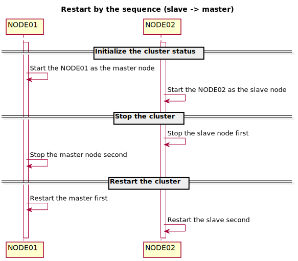

# 
# Postgres HA
## Table of contents
1. [Restful specification](#restful-specification)
  - /api/pg/v1/instance/:scope
  - /api/pg/v1/node/:scope
  - /api/pg/v1/lsn/:scope
  - /api/pg/v1/walFiles/:scope
  - /api/pg/v1/walFile/:walFile
  - /api/pg/v1/in_recovery
  - /api/pg/v1/validLsn
2. Logical Replication(#logical-replication)
3. [Test cases](#test-cases)

## Restful Specification
  |No | Resource                   | POST              | GET                                   |PUT                          | DELETE               |
  |-- | ----                       | ----              | -----                                 | -----                       | ----                 |
  |1  | /api/pg/v1/instance/:scope | Start pg instance | Get the instance state                | -                           | Stop the pg instance |
  |2  | /api/pg/v1/node/:scope     | Promote the slave | -                                     | -                           | -                    |
  |3  | /api/pg/v1/lsn/:scope      | -                 | Get the pg's lsn info                 | -                           | -                    |
  |4  | /api/pg/v1/walFiles/:scope | -                 | Get the wal files from specified lsn  | -                           | -                    |
  |5  | /api/pg/v1/walFile/:walFile| -                 | Get the wal file from remote          | Push the wal file to remote | -                    |
  |6  | /api/pg/v1/in_recovery     | -                 | Get the node's recovery mode          | -                           | -                    |
  |7  | /api/pg/v1/validLsn/:scope | -                 | Check whether the lsn is valid        | -                           | -                    |

### /api/pg/v1/instance/:scope 
#### GET
**Get the specified node's state**
```shell
$curl -X GET http://pg-node01:8079/api/pg/v1/instance/current
{"pg-node01":"single"}%
```
**Get all nodes' state**
```shell
$curl -X GET http://pg-node01:8079/api/pg/v1/instance/all
{"pg-node01":"single","pg-node02":"inactive"}%
```
  |No | state    | Comment       |
  |-  | -        | -             |
  | 1 | single   | single node   |
  | 2 | master   | master node   |
  | 3 | slave    | slave node    |
  | 4 | inactive | Not started   |
  | 5 | recovery | Recovery mode |

#### POST

  | No | Scope           | Sequence           | Comment                                                             |
  | -  | -               | -                  | -                                                                   |
  | 1  | current         |                    | Start the specified node (pg_ctl stop -D /DATA)                     |
  | 2  | master          |                    | Start the specified node as master                                  |
  | 3  | slave           |                    | Start the specified node as slave                                   |
  | 4  | all             | masterSlave        | Start the node by the sequence(the master -> another slave)         |
  | 5  | failover        | restart            | Promote the slave node by restarting                                |
  | 6  | failover        | promote            | Promote the slave node by promoting                                 |
  | 7  | switchover      | masterSlave        | Switchover (master down -> slave down -> slave up -> master up)     |
  | 8  | switchover      | slaveMaster        | Switchover (slave down -> master down -> slave up -> master up)     |

**Start the node directly**
Start the nodes without any special conversion in the database side
```shell
$curl -X POST http://pg-node01:8079/api/pg/v1/instance/current
{"pg-node01":"single","pg-node02":"inactive"}
$curl -X POST http://pg-node02:8079/api/pg/v1/instance/current
{"pg-node02":"slave","pg-node01":"master"}
```

**Start the node as master**
```shell
$curl -X POST http://pg-node02:8079/api/pg/v1/instance/master
{"pg-node01":"inactive","pg-node02":"single"}
```

**Start the node as slave**
```shell
$curl -X POST http://pg-node01:8079/api/pg/v1/instance/slave
{"pg-node01":"slave","pg-node02":"master"}
```

**Start the nodes be the sequence (Master -> Slave)**
```shell
$curl -X POST http://pg-node01:8079/api/pg/v1/instance/all
{"pg-node01":"master","pg-node02":"slave"}%
```

**Failover (stop slave -> start node as master)**
Promote the slave node to master by restarting the node does not change the timeline of wal
```shell
$curl -X GET http://pg-node01:8079/api/pg/v1/instance/all
{"pg-node01":"master","pg-node02":"slave"}
$curl -X GET http://pg-node01:8079/api/pg/v1/lsn/all | python -m json.tool
{
    "pg-node01": {
        "chkPoint": "0/56000028",
        "chkRedoPoint": "0/56000028",
        "lastLsn": "0/56000108",
        "timeLineID": "4",
        "walFile": "000000040000000000000056"
    },
    "pg-node02": {
        "chkPoint": "0/56000098",
        "chkRedoPoint": "0/56000098",
        "lastLsn": "0/56000108",
        "timeLineID": "4",
        "walFile": "000000040000000000000056"
    }
}
$curl -X DELETE http://pg-node01:8079/api/pg/v1/instance/master
{"pg-node01":"inactive","pg-node02":"single"}
$curl -X POST http://pg-node02:8079/api/pg/v1/instance/failover/restart
{"pg-node02":"single","pg-node01":"inactive"}
$curl -X POST http://pg-node01:8079/api/pg/v1/instance/slave
{"pg-node01":"slave","pg-node02":"master"}
$curl -X GET http://pg-node01:8079/api/pg/v1/lsn/all | python -m json.tool
{
    "pg-node01": {
        "chkPoint": "0/56000028",
        "chkRedoPoint": "0/56000028",
        "lastLsn": "0/56000108",
        "timeLineID": "4",
        "walFile": "000000040000000000000056"
    },
    "pg-node02": {
        "chkPoint": "0/56000098",
        "chkRedoPoint": "0/56000098",
        "lastLsn": "0/56000108",
        "timeLineID": "4",
        "walFile": "000000040000000000000056"
    }
}
```

**Failover (Promote)**
Promote the slave node to master by promote command incremental the timeline of wal
```shell
$curl -X GET http://pg-node01:8079/api/pg/v1/instance/all
{"pg-node01":"slave","pg-node02":"master"}
$curl -X GET http://pg-node01:8079/api/pg/v1/lsn/all | python -m json.tool
{
    "pg-node01": {
        "chkPoint": "0/56000028",
        "chkRedoPoint": "0/56000028",
        "lastLsn": "0/56000108",
        "timeLineID": "4",
        "walFile": "000000040000000000000056"
    },
    "pg-node02": {
        "chkPoint": "0/56000098",
        "chkRedoPoint": "0/56000098",
        "lastLsn": "0/56000108",
        "timeLineID": "4",
        "walFile": "000000040000000000000056"
    }
}
$curl -X DELETE http://pg-node01:8079/api/pg/v1/instance/master
{"pg-node01":"single","pg-node02":"inactive"}
$curl -X POST http://pg-node01:8079/api/pg/v1/instance/failover/promote
{"pg-node01":"single","pg-node02":"inactive"}
$curl -X POST http://pg-node02:8079/api/pg/v1/instance/slave
{"pg-node01":"master","pg-node02":"slave"}   => {"pg-node01":"single","pg-node02":"single"}
$curl -X GET http://pg-node01:8079/api/pg/v1/lsn/all | python -m json.tool
{
    "pg-node01": {
        "chkPoint": "0/57000100",
        "chkRedoPoint": "0/570000C8",
        "lastLsn": "0/57000170",
        "timeLineID": "5",
        "walFile": "000000050000000000000057"
    },
    "pg-node02": {
        "chkPoint": "0/57000028",
        "chkRedoPoint": "0/57000028",
        "lastLsn": "0/57000028",
        "timeLineID": "4",
        "walFile": "000000040000000000000057"
    }
}
```
Here has one issue to resolve. When starting the slave, the got status is not updated. Still showing both single, has to wait for a moment

**Switch the master slave by the sequence (master down -> slave down -> slave start as master -> master start as slave)**
```shell
$curl -X GET http://pg-node01:8079/api/pg/v1/instance/all
{"pg-node01":"master","pg-node02":"slave"}
$curl -X POST http://pg-node01:8079/api/pg/v1/instance/switchover/masterSlave
{"pg-node01":"slave","pg-node02":"master"}
```

**Switch the master slave by the sequence (slave down -> master down -> slave start as master -> master start as slave)**
```shell
$curl -X GET http://pg-node01:8079/api/pg/v1/instance/all
{"pg-node01":"slave","pg-node02":"master"}
$curl -X POST http://pg-node01:8079/api/pg/v1/instance/switchover/slaveMaster
{"pg-node01":"master","pg-node02":"slave"}
```

#### DELETE

  | No | Scope       | Comment                                        |
  | -  | -           | -                                              |
  | 1  | current     | Stop the specified node (pg_ctl stop -D /DATA) |
  | 2  | master      | Find the master node to stop                   |
  | 3  | slave       | Find the slave node to stop                    |
  | 4  | all         | Stop by the sequence(slave -> master)          |
  | 5  | slaveMaster | same to all                                    |
  | 6  | masterSlave | Stop by the sequence(master -> slave)          |

**Stop the specified node**
```shell
$curl -X DELETE http://pg-node01/api/pg/v1/instance/current
{"pg-node01":"inactive","pg-node02":"inactive"}
```

**Stop the master node if exists**
```shell
$curl -X GET http://pg-node01:8079/api/pg/v1/instance/all
{"pg-node01":"slave","pg-node02":"master"}
$curl -X DELETE http://pg-node01/api/pg/v1/instance/master
{"pg-node01":"single","pg-node02":"inactive"}
```

**Stop the slave node if exists**
--todo
```shell
$curl -X DELETE http://pg-node01/api/pg/v1/instance/slave
```

**Stop the nodes by the sequence (slave -> master)**
```shell
$curl -X DELETE http://pg-node01:8079/api/pg/v1/instance/slaveMaster
{"pg-node01":"inactive","pg-node02":"inactive"}
```

**Stop the nodes by the sequence (master -> slave)**
```shell
$curl -X DELETE http://pg-node01:8079/api/pg/v1/instance/masterSlave
{"pg-node01":"inactive","pg-node02":"inactive"}
```


### /api/pg/v1/node/:scope
```shell
curl -X POST http://pg-node01:8079/api/pg/v1/node/promote
{"pg-node-01":"single","pg-node-02":"inactive"}% 
```
### /api/pg/v1/lsn/:scope
**Get the node's lsn info**
```shell
$curl -X GET http://pg-node01:8079/api/pg/v1/lsn/current
{"hostname":{"chkPoint":"0/39000100","chkRedoPoint":"0/390000C8","walFile":"000000040000000000000039","timeLineID":"4","lastLsn":"0/39000170"}}
```

**Get all nodes's lsn  info**
```shell
$curl -X GET http://pg-node01:8079/api/pg/v1/lsn/all
{"pg-host-01":{"chkPoint":"0/39000100","chkRedoPoint":"0/390000C8","walFile":"000000040000000000000039","timeLineID":"4","lastLsn":"0/39000170"},
 "pg-host-02":{"chkPoint":"0/39000028","chkRedoPoint":"0/39000028","walFile":"000000030000000000000039","timeLineID":"3","lastLsn":"0/39000028"}}%
```
### /api/pg/v1/walFiles/:scope
**Call from timeline/lsn**
```shell
$curl -X GET http://hostname/api/pg/v1/walFiles/3/0/39000028
[{"file":"000000030000000000000039.partial","md5":"eedd5ebc09b162d8464ff53d9c98f492"},{"file":"00000004.history","md5":"6e2a9301e80b7a952fcd69d574c7dfc7"},{"file":"000000040000000000000039","md5":"add3d229ab7a6fa5c95de7c5e86aa5b4"}]
```

**Call from wal file**
```shell
$curl -X GET http://pg-node01:8079/api/pg/v1/walFiles/000000030000000000000039 
[{"file":"000000030000000000000039.partial","md5":"eedd5ebc09b162d8464ff53d9c98f492"},{"file":"00000004.history","md5":"6e2a9301e80b7a952fcd69d574c7dfc7"},{"file":"000000040000000000000039","md5":"add3d229ab7a6fa5c95de7c5e86aa5b4"}]
```

### /api/pg/v1/walFile/:walFile
**Upload the wal file to remote**
```shell
$curl -i -X POST -H "Content-Type: multipart/form-data" -F "data=@/tmp/000000030000000000000018" http://hostname/api/pg/v1/walFile/000000080000000000000039
HTTP/1.1 100 Continue

HTTP/1.1 200 OK
Content-Type: text/plain; charset=utf-8
Content-Length: 80
Date: Wed, 24 Oct 2018 01:39:20 GMT
Connection: keep-alive

{"code":0,"msg":"The file </data/pg_wal/000000080000000000000039> was uploaded"}
```

**Download the wal file from remote**
```shell
$curl -X GET http://hostname/api/pg/v1/walFile/000000040000000000000039 --output /tmp/000000040000000000000039
  % Total    % Received % Xferd  Average Speed   Time    Time     Time  Current
                                 Dload  Upload   Total   Spent    Left  Speed
100 16.0M  100 16.0M    0     0   127M      0 --:--:-- --:--:-- --:--:--  129M
```

### /api/pg/v1/in_recovery
```shell
$curl -X GET http://hostname/api/pg/v1/in_recovery
{"in_recovery":"f"}
```
### /api/pg/v1/validLsn 

```shell
$curl -X GET http://hostname/api/pg/v1/validLsn/3/0/39000028
{"code":0,"msg":"Valid lsn","cnt":"1"}
```
  | No | Field | Comment                           |
  | -  | -     | -                                 |
  | 1  | code  | return code                       |
  | 2  | msg   | return message                    |
  | 3  | cnt   | Number of entries beghind the lsn |

## Logical Replication
### The logical slot meta data 
 |slot_name |   plugin    | slot_type | datoid | temporary | active | active_pid | xmin | catalog_xmin | restart_lsn | confirmed_flush  |
 |-         | -           | -         | -      | -         | -      | -          | -    | -            | -           | -                |
 |test02    | decoderbufs | logical   |  16385 | f         | f      |            |      |          630 | 0/5D000E30  | 0/5E000140       |

### Binary data from pg_replset/test02/state
```shell
          |<-int->| ||
00000000: a11c 0501 c8c5 aa47 0200 0000 a000 0000  .......G........
          |<- Slot name
00000010: 7465 7374 3032 0000 0000 0000 0000 0000  test02..........
00000020: 0000 0000 0000 0000 0000 0000 0000 0000  ................
00000030: 0000 0000 0000 0000 0000 0000 0000 0000  ................
                                              ->|
00000040: 0000 0000 0000 0000 0000 0000 0000 0000  ................

                    Slot Persistency
          DB oid              xmin      catalog_xmin
          |<-   ->| |<-   ->| |<-   ->| |<-   ->|
00000050: 0140 0000 0000 0000 0000 0000 7602 0000  .@..........v...
          database oid     : 0000 4001 -> select oid from pg_data where datname = 'dbname';
          slot Persistency : RS_PERSISTENT/RS_EPHEMERAL/RS_TEMPORARY
          catalog_xmin     : 0000 0276 -> select catalog_xmin from pg_get_replication_slots() where slot_name = 'slot name';

                                 confirmed_flush
          |<- restart_lsn ->| |<-             ->|
00000060: 300e 005d 0000 0000 4001 005e 0000 0000  0..]....@..^....
          restart_lsn      : 0000 0000 5D00 0E30 -> select restart_lsn from  pg_get_replication_slots() where slot_name = 'slot name'
          confirmed_flush  : 0000 0000 5E00 0140 -> select confirmed_flush_lsn from  pg_get_replication_slots() where slot_name = 'slot name'

          |<- plugin name
00000070: 6465 636f 6465 7262 7566 7300 0000 0000  decoderbufs.....
00000080: 0000 0000 0000 0000 0000 0000 0000 0000  ................
00000090: 0000 0000 0000 0000 0000 0000 0000 0000  ................
                                              ->|
000000a0: 0000 0000 0000 0000 0000 0000 0000 0000  ................
```

## Test cases
### Slave restart

### Master restart
### Switch Over(Slave->Master)
### Switch Over(Master->Slave)
### Fail over (Restart slave)
### Fail over (Promote slave)
